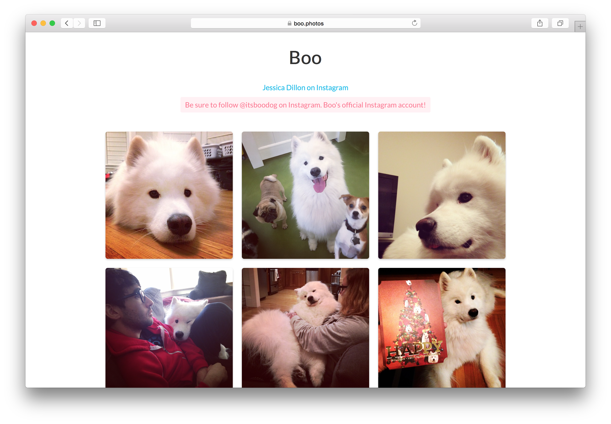

Boo Photos
===

Hello
---

This is the unofficial #TheBooDog photo gallery. It contains all the photos of
boo from [@jessicardillon](http://instagram.com/jessicardillon)'s Instagram.

I do not claim to own Boo, I wish I did, but I don't.

Please feel free to make the site more _boo_, and send a PR.

Running Locally
---

Make sure you have Node.js (and NPM) installed.

Install the devDependencies by running...

```
npm install
```

Set the `INSTAGRAM_ACCESS_TOKEN` environment variable to your Instagram OAuth
access token. This is required for pulling data from Instagram.

```
export INSTAGRAM_ACCESS_TOKEN=111111111.2222222.33333333333333333333333333333333
```

Then run the `dump.js` script using Node.js. The script will open the `data.json`
file, and (5 at a time) pull the meta data of each photo and store it within the
`data` folder. If the meta data has already been dumped, it will not be
re-dumped. You will need to delete the meta data file first.

```
node dump.js
```

What it looks like...
---

